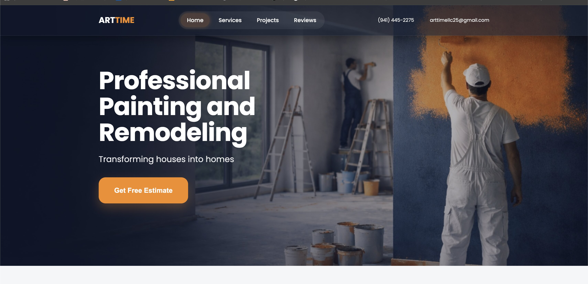

# 🎨 Art Time LLC Website

🔗 Live Demo: https://arttime-llc.netlify.app

## 📱 Features
- Responsive design
- Mobile menu
- Contact form (Telegram)
- Fast performance

<p align="center">
  Modern premium renovation website built with Vite
</p>

---

<p align="center">


</p>

---

## 🚀 Live Demo

👉 https://arttime-llc.netlify.app/

---

## 📸 Preview



```id="preview-placeholder"

```

---

## ✨ Features

- 💎 Premium UI design
- ⚡ Fast performance (Vite)
- 📱 Fully responsive
- 🎯 Conversion-focused layout
- 📩 Telegram contact form (no backend)
- 🖼 Gallery with slider + lightbox
- 🎬 Smooth animations

---

## 🛠 Tech Stack

- HTML5
- CSS3
- JavaScript (ES6+)
- Vite
- Swiper.js
- Lottie
- SVG Sprite

---

## 📁 Project Structure

```id="struct-pro"
public/
  hero.jpg
  partials/
  img/

src/
  css/
  js/
```

---

## ⚙️ Getting Started

### Install

```bash id="install-pro"
npm install
```

### Run locally

```bash id="run-pro"
npm run dev
```

### Build

```bash id="build-pro"
npm run build
```

---

## 🖼 Images (IMPORTANT)

All images must be inside `/public`

✅ Correct:

```css id="img-ok"
background-image: url("/hero.jpg");
```

❌ Wrong:

```css id="img-bad"
background-image: url("../img/hero.jpg");
```

---

## 🧠 Git Workflow

```bash id="git-pro"
git add .
git commit -m "update"
git push
```

---

## 📩 Telegram Integration

Contact form → Netlify Function → Telegram Bot

Required environment variables:

```id="env-pro"
TELEGRAM_TOKEN=your_token
TELEGRAM_CHAT_ID=your_chat_id
```

---

## 🌐 Deployment (Netlify)

Build:

```id="deploy-build"
npm run build
```

Publish:

```id="deploy-dist"
dist
```

⚠️ Notes:

- Works only on Netlify
- Functions require HTTPS

---

## 🔧 Customization

You can easily update:

- texts (partials)
- images (`/public`)
- services
- reviews
- contacts

---

## 🔮 Roadmap

- [ ] SEO optimization
- [ ] Google Reviews API
- [ ] Blog / FAQ

---

## 👨‍💻 Author

**ArtTime Project**

---
